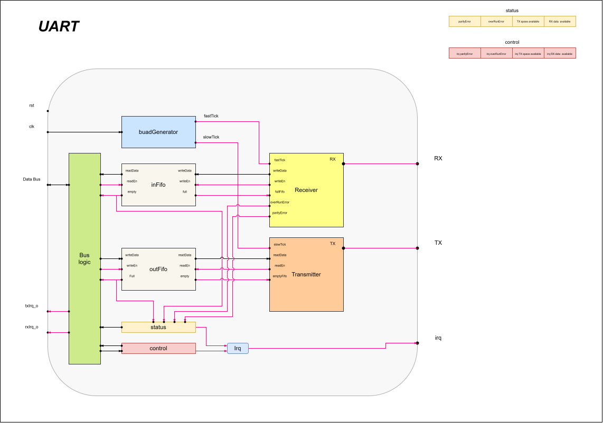

# UART IP

A parametrizable, modular UART with FIFO buffers, even parity, and interrupt support.

---

## Features

- **Configurable baud rate** and **FIFO depth** at synthesize time
- **8 data bits**, **even parity**
- **Interrupts**: RX available, TX empty, overrun, parity error
- **Modular architecture**: separate transmitter, receiver, baud generator, and FIFO modules

---

## Memory Map

The UART provides three 32-bit registers accessible through the bus interface.

| Address | Register | Access | Description |
| ------- | -------- | ------ | ----------- |
| `0x0`   | `DATA`   | R/W    | **Write:** Pushes a byte into the TX FIFO.<br>**Read:** Pops a byte from the RX FIFO. Only the lower 8 bits are used; upper 24 bits read as zero. |
| `0x4`   | `STATUS` | R/W (selective) | Status flags. **Write:** Bits `[3:2]` can be overwritten to clear overrun and parity errors. Bits `[1:0]` are read-only. |
| `0x8`   | `CONTROL`| R/W    | Interrupt enable bits. Writing `1` enables the corresponding interrupt source. |

## STATUS Register Bits

| Bit | Name | Access | Description |
| --- | ---- | ------ | ----------- |
| 0   | `RX_AVAIL` | RO | `1` when RX FIFO is not empty (receive data available). |
| 1   | `TX_AVAIL` | RO | `1` when TX FIFO is not full (transmit space available). |
| 2   | `OVERRUN`  | RW1C* | `1` indicates an overrun error occurred (RX FIFO full when a new byte arrived). Write `0` to clear. |
| 3   | `PARITY_ERR` | RW1C* | `1` indicates a parity error was detected on a received frame. Write `0` to clear. |

> **Note :** The hardware sets these bits to `1` when an error occurs. The CPU clears them by writing `0` to the corresponding bit. Writing `1` has no effect. Bits `[3:2]` are treated as a simple overwrite: a write of `dataIn[3:2]` replaces the current value. To clear only one error while preserving the other, write a `0` to the bit you want to clear and a `1` to the other bit.


## CONTROL Register Bits

| Bit | Name | Access | Description |
| --- | ---- | ------ | ----------- |
| 0   | `RX_IRQ_EN` | RW | Enable interrupt on RX data available (`STATUS[0]`). |
| 1   | `TX_IRQ_EN` | RW | Enable interrupt on TX space available (`STATUS[1]`). |
| 2   | `OVERRUN_IRQ_EN` | RW | Enable interrupt on overrun error (`STATUS[2]`). |
| 3   | `PARITY_IRQ_EN` | RW | Enable interrupt on parity error (`STATUS[3]`). |

All bits are active-high. The `irq` output is asserted when any enabled interrupt condition is true, i.e.:

```verilog
irq = (controlReg[0] & statusReg[0]) |
      (controlReg[1] & statusReg[1]) |
      (controlReg[2] & statusReg[2]) |
      (controlReg[3] & statusReg[3]);
```

## Ports

| Port Name | Direction | Width | Description |
| --------- | --------- | ----- | ----------- |
| `clk` | Input | 1 | System clock. All logic is synchronous to this clock. |
| `rst` | Input | 1 | Asynchronous active-high reset. |
| `TX` | Output | 1 | UART transmit line (idle high). |
| `RX` | Input | 1 | UART receive line (idle high). |
| `irq` | Output | 1 | Interrupt request output, active high. |
| `readRequest` | Input | 1 | Asserted during a valid memory-mapped read transaction. |
| `writeRequest` | Input | 1 | Asserted during a valid memory-mapped write transaction. |
| `address` | Input | 32 | Memory-mapped byte address. Only the lower bits are used. |
| `dataIn` | Input | 32 | Write data bus. |
| `dataOut` | Output | 32 | Read data bus. |

---


## Software Integration

For a comprehensive guide, C macros, and complete bare-metal integration examples, please refer to the software documentation:

**[Software Integration Guide](doc/software.md)**

---

## Architecture Schematic

